# Biblioteca Brotero

Aplicação web do catálogo e requisições da **Biblioteca Escolar** (fluxo de leitores por cartão, balcão de bibliotecários e painel de staff).

## Stack

- **Backend:** Laravel 12, PHP 8.2+
- **Frontend:** React 19, Inertia.js, Tailwind CSS
- **Auth:** Fortify (utilizadores web), guard `patron` (cartão + data de nascimento no quiosque)

## Funcionalidades (visão geral)

- Catálogo público (`/biblioteca`), página de livro e filtros
- Conta do leitor: pedidos, histórico, favoritos, perfil
- Modo **bibliotecário** no quiosque: balcão de requisições, novos livros, edição de fichas
- Painel **staff** (e-mails configuráveis) para aprovar pedidos

## Requisitos

- PHP 8.2+, Composer
- Node.js + npm (build dos assets)
- Base de dados suportada pelo Laravel (MySQL, SQLite, etc.)

## Arranque rápido

```bash
composer install
cp .env.example .env
php artisan key:generate
php artisan migrate
php artisan storage:link   # capas de livros em público

npm install
npm run build   # ou npm run dev
php artisan serve
```

Configure variáveis em `.env` (base de dados, `APP_URL`, opções em `config/biblioteca.php` quando aplicável).

## Capturas de ecrã

Imagens em [`docs/images/`](docs/images/). Para acrescentar mais prints, guarde-os nessa pasta e replique o bloco `###` + `` abaixo.

### Catálogo e descoberta

**Página inicial** — pesquisa, categorias, novidades, recomendações e «os mais pedidos».

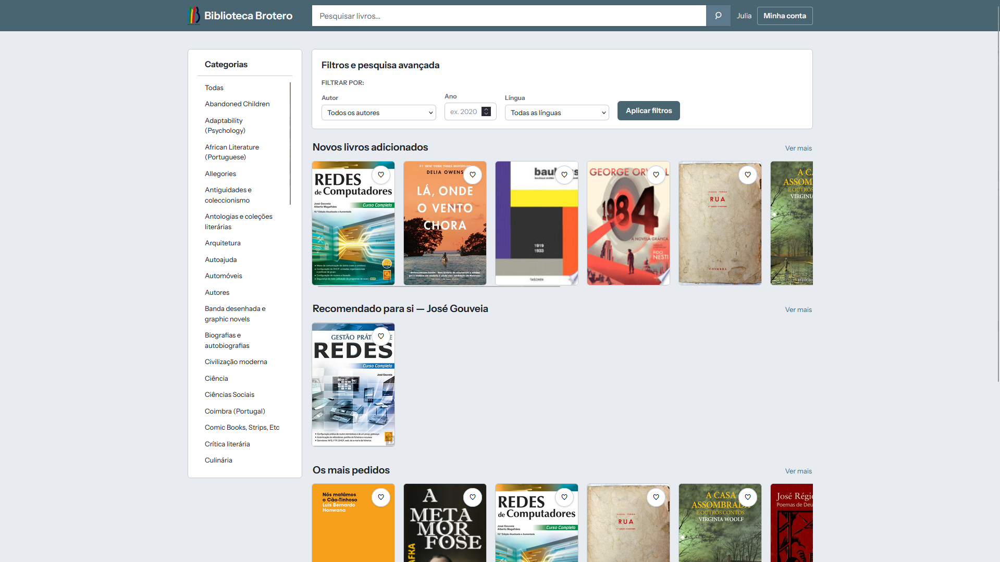

**Ranking de leitores** — gamificação por pontos.

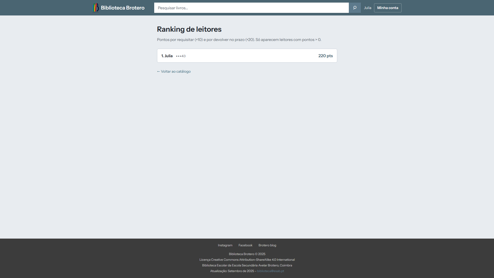

**Todos os livros** — listagem completa com índice alfabético.

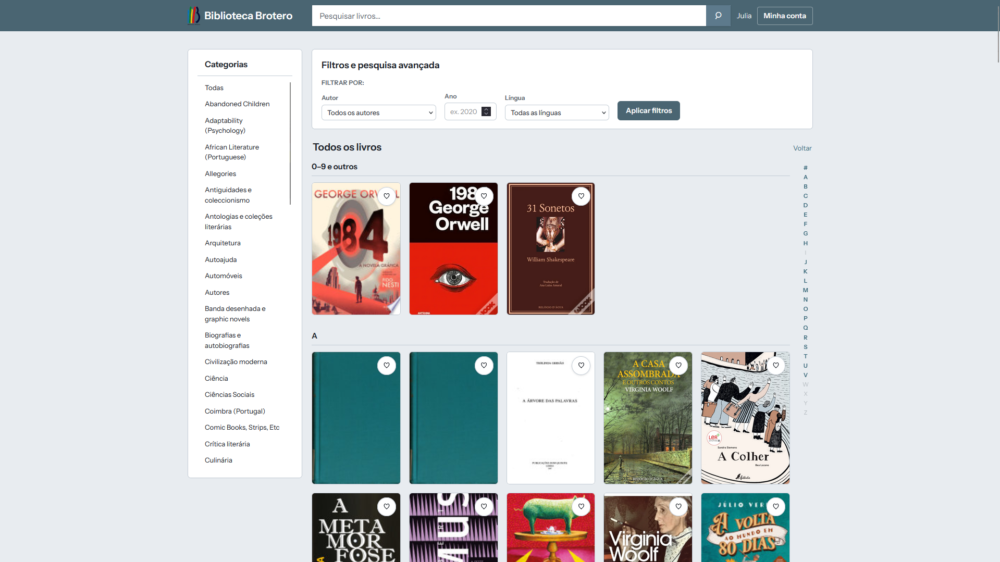

### Conta do leitor

**Pedidos activos** — requisições em curso e prazos.

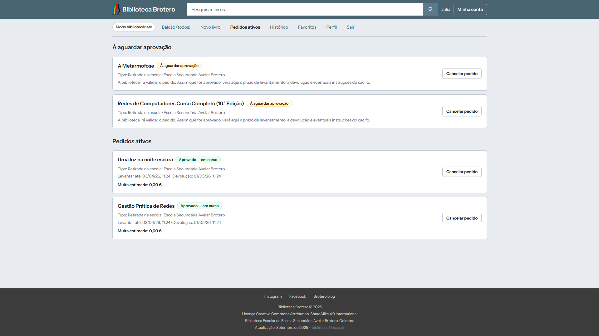

**Histórico** — pedidos concluídos ou recusados.

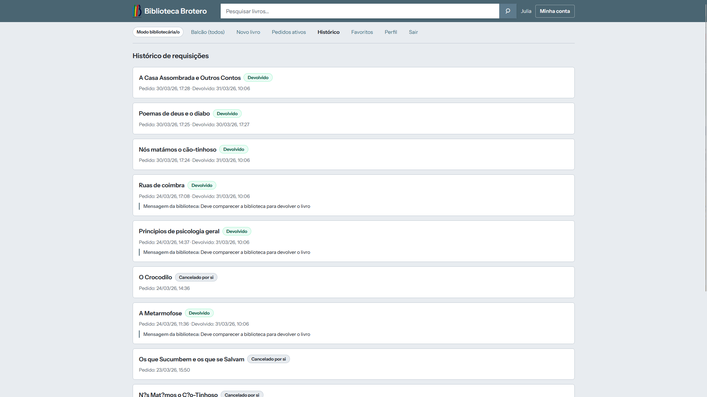

**Favoritos** — livros marcados com o coração.

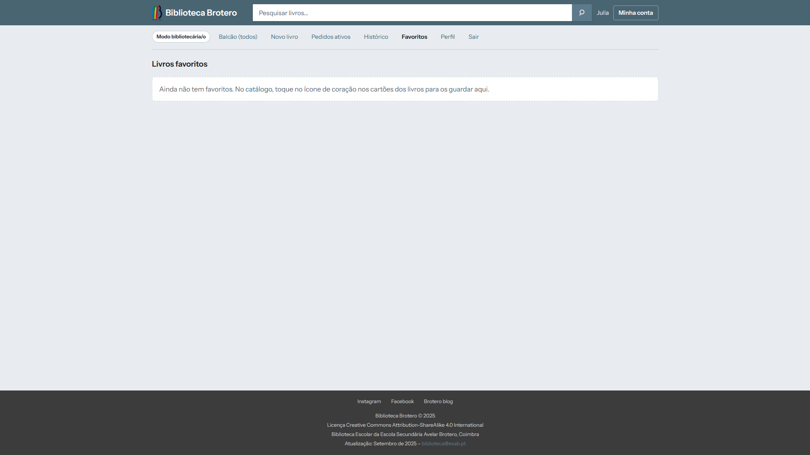

**Perfil** — dados do cartão (ex.: utilizadora bibliotecária no quiosque).

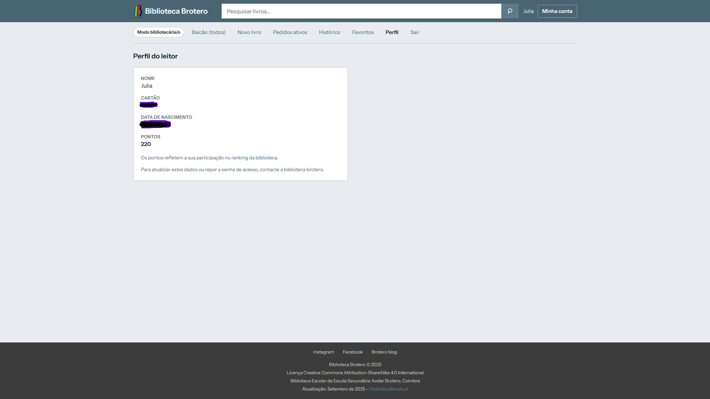

### Requisitar um livro

**Informação na ficha do livro** — zona de requisição e escolha de local.

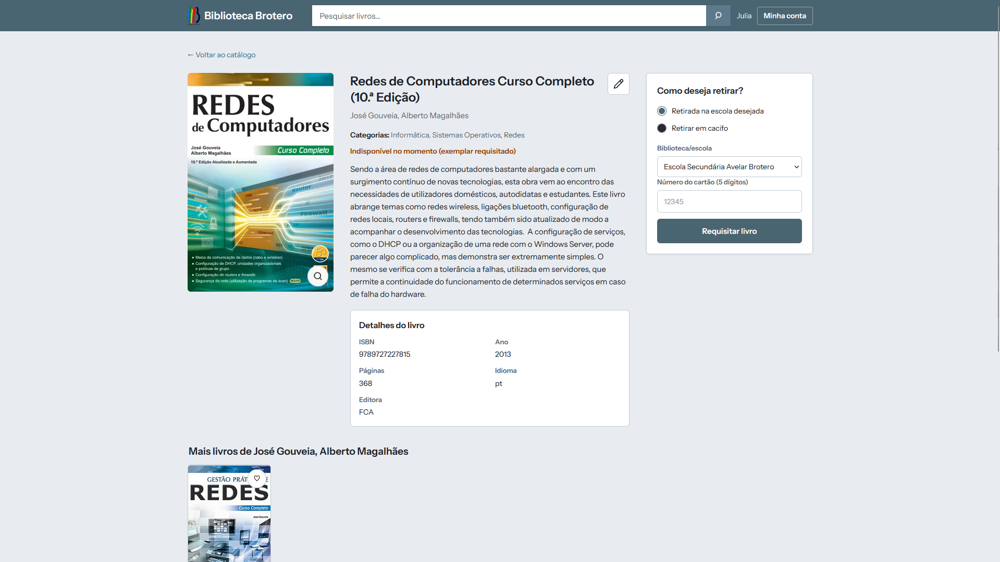

**Modo aluno** — fluxo de requisição no catálogo.

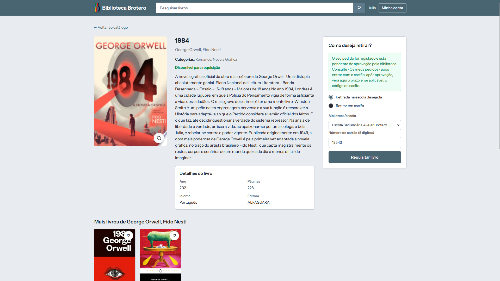

**Após pedir (cacifo)** — confirmação do tipo de levantamento.

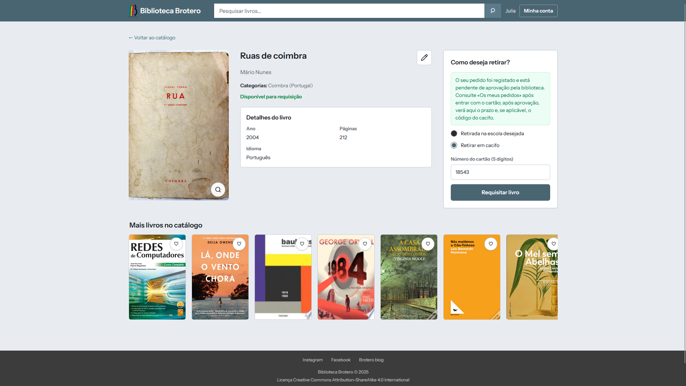

### Modo bibliotecário (balcão)

**Adicionar livros** — entrada manual no catálogo.

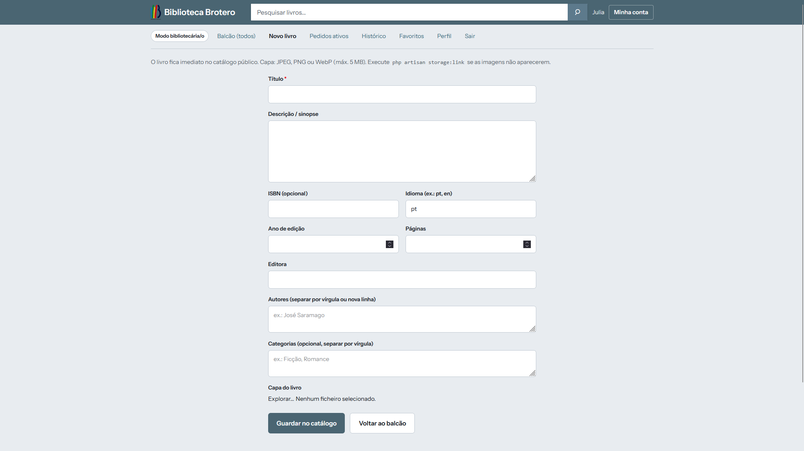

**Balcão** — gestão de pedidos de todos os cartões.

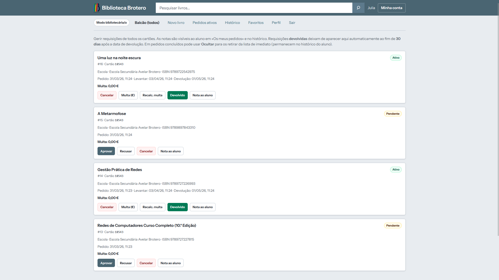

**Aprovação no balcão** — pedidos *pendentes* (Aprovar / Recusar / Cancelar) e requisições *activas* (multa, devolução, nota ao aluno).

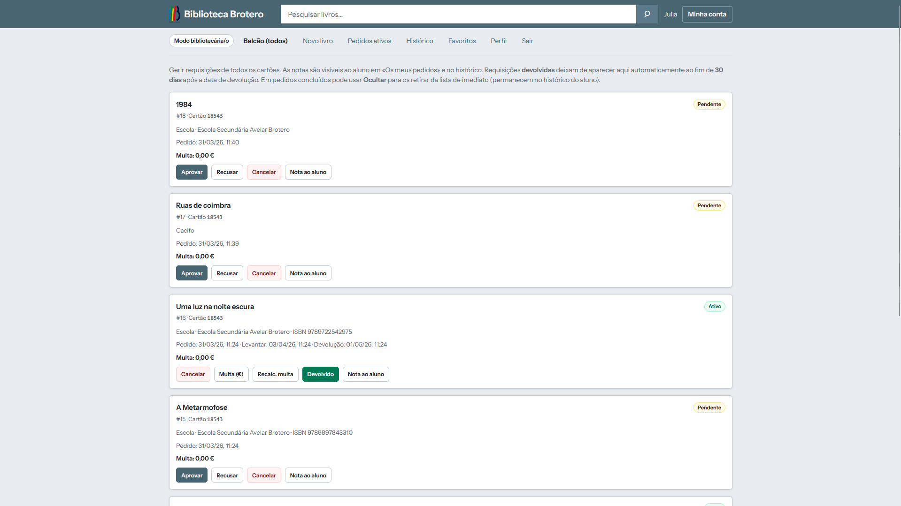

## Licença

MIT (conforme indicado no projeto base Laravel).
